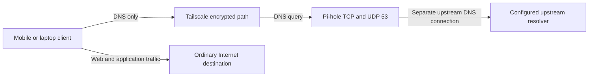

# Architecture

## Core design

The core deployment is DNS-only. A remote client sends DNS over its encrypted
Tailscale path to Pi-hole. Pi-hole then uses its own configured upstream
resolver. Normal application traffic uses the client's ordinary Internet path.

The diagram is the repository's single source of architecture-diagram truth.

## Traffic paths

### DNS-only path

1. The client system resolver sends a query using the DNS settings supplied by
   Tailscale.
2. Tailscale carries the query to `<PIHOLE_TAILSCALE_IP>`.
3. The host firewall and tailnet policy independently allow TCP and UDP port 53.
4. Pi-hole answers from cache or filtering data, or queries its upstream.
5. The response returns through Tailscale.

### Exit Node path

An Exit Node is not part of the core deployment. When selected, it can carry
ordinary Internet traffic and may change DNS selection. See
[DNS-only versus Exit Node](advanced/exit-node.md).

## Trust and encryption boundaries

- Tailscale encrypts the client-to-Pi-hole path, including a DERP-relayed path.
- Pi-hole-to-upstream DNS is separate. It is encrypted only if the selected
  upstream protocol provides encryption.
- Tailscale policy controls tailnet traffic only. It does not replace the host
  firewall, router firewall, or Pi-hole access controls.
- Pi-hole query logs can reveal browsing activity and are private.
- The DNS-only design does not encrypt or route ordinary application traffic.

## Failure boundaries

A single Pi-hole is a single point of failure when it is the only global
nameserver. Clients that remain connected and accept the override will generally
lose system DNS until Pi-hole returns or the override is removed. Applications
with independent DNS can behave differently.

Do not add an unfiltered secondary resolver. Resolver order is not guaranteed,
and clients or Tailscale can query multiple resolvers in parallel. Use a second
equivalently filtered Pi-hole for redundancy.

## Security layers

Access requires every relevant layer to permit it:

1. Tailscale device authentication.
2. Tailnet grant for TCP and UDP port 53.
3. Host firewall permission on `tailscale0`.
4. Pi-hole listening behavior that accepts the source.

A narrow grant does not cancel an older broad rule because Tailscale policies
are additive.
